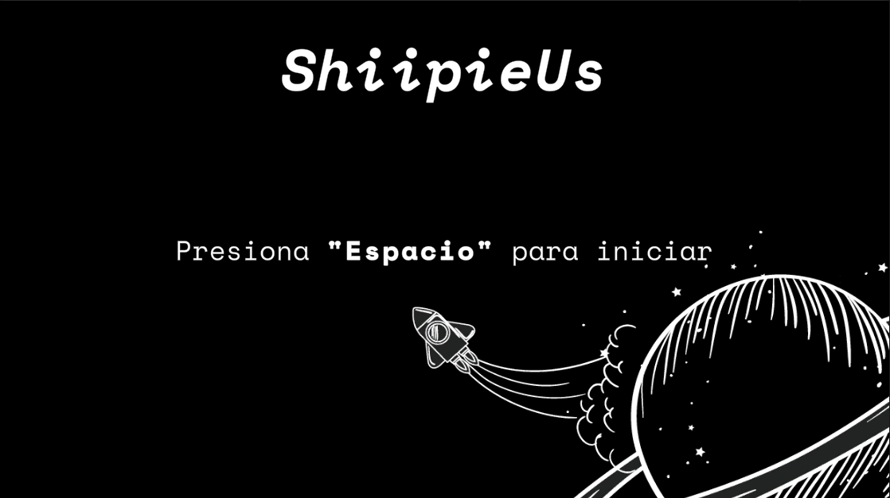

# PolygUn Test
## Juan Diego Mozo Osorio Test
El presente proyecto es la prueba técnica de PolygonUs para el puesto de desarrollador de juegos de Unity.

# Requerimientos:
###### 1. Juego de nave top down.
###### 2. En este juego deberás hacer que tu nave se mueva de arriba, abajo, izquierda y derecha sobre un tablero.
###### 3. Deberás colocar monedas aleatorías en el espacio, estás serían elementos coleccionables. Cada moneda que el jugador recolecta dará un puntaje (5 puntos),
###### 4. La nave podrá disparar hacia enemigos que vengan a atcarla.
###### 5. Morirás con el primer contacto.
###### 6. Las naves enemigas podrán tener un movimiento aleatorio en la pantalla (pueden ir hacia el jugador). Las naves enemigas pueden atacar al jugador. El destruir una nave da un puntaje de (8 puntos).
#
###### Nota: `Para los vacios que encuentre, deberá elegir a su discreación la manera que para usted sea más adecuada.`
#
#

# Descripciones técnicas:

```sh
Versión del proyecto:
0.0.4
-------------------
Versión de Unity:
2021.3.24f1
------------------
```
[Release of the Game](https://github.com/jdmozo/polygonUsTest/releases "Game") Descarguenlo para pobrar.


# Elementos Utilizados


### Audios
##### Music
[Lobby Music](https://freesound.org/people/Xythe/sounds/516912/ "Audio")
[In Game Music](https://pixabay.com/music/techno-trance-melodic-techno-03-extended-version-moogify-9867/ "Audio")

##### SFX
[Ship Start](https://freesound.org/people/InspectorJ/sounds/458586/ "Audio")
[Shoot](https://freesound.org/people/MATRIXXX_/sounds/455251/ "Audio")
[Explotion](https://freesound.org/people/wubitog/sounds/200465/ "Audio")
[Coin](https://freesound.org/people/ProjectsU012/sounds/341695/ "Audio")

### Fonts
[Space Mono](https://fonts.google.com/specimen/Space+Mono/ "Font")

### Plataforma principal:
##### `Windows 10 u 11`
(A furuto se puede agregar a más plataformas)
#
## Tomas del juego



## Licencia
MIT